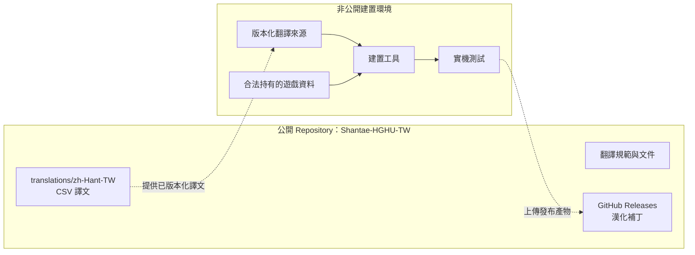
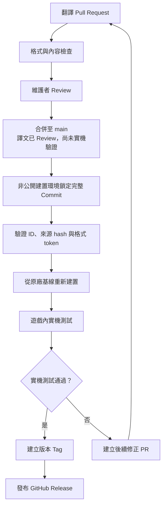

# Shantae-HGHU-TW

《桑塔：半精靈英雄 終極版》台灣正體中文漢化專案。

> Shantae: Half-Genie Hero Ultimate Edition — Traditional Chinese (Taiwan) localization project

[](https://github.com/AghDoo/Shantae-HGHU-TW/releases)
[](https://github.com/AghDoo/Shantae-HGHU-TW/actions/workflows/translation-pr.yml)
[](https://github.com/AghDoo/Shantae-HGHU-TW/blob/main/LICENSE)
[](translations/zh-Hant-TW/)
[](https://github.com/AghDoo/Shantae-HGHU-TW/releases)
[](https://github.com/AghDoo/Shantae-HGHU-TW/stargazers)
[](https://github.com/AghDoo/Shantae-HGHU-TW/issues)
[](https://www.star-history.com/#AghDoo/Shantae-HGHU-TW&Date)

## 專案定位

本 Repository 是公開的翻譯協作與版本發布入口，用於：

- 維護 `zh-Hant-TW` 台灣正體中文譯文。
- 接受翻譯修正 Pull Request。
- 記錄翻譯規範、詞彙與已知問題。
- 透過 GitHub Releases 發布經測試的漢化版本。

完整建置環境、遊戲原始文本與正版遊戲檔案不會存放於本 Repository。

## Repository 關係



## 翻譯 PR 資料流



Public `main` 是已通過公開 Review 的譯文來源，不等於已通過實機驗證的
Release。公開 PR 不要求在合併前產生候選 PAK；合併後才由非公開流水線
鎖定完整 commit、建置候選包並執行實機測試。測試失敗時以新的修正 PR
接續處理，未通過的 commit 不會發布。

## 目錄規劃

```text
translations/zh-Hant-TW/   可透過 PR 修改的 CSV 譯文
docs/                       安裝、相容性與已知問題
.github/                    PR Template 與自動檢查
release/                    Release 格式與打包說明
```

目前公開目錄為
[`translations/zh-Hant-TW/strings.csv`](translations/zh-Hant-TW/strings.csv)。
它只含不透明 ID、粗略區域、譯文、必要格式 token 與譯者備註；
不含官方原文、PAK 名稱、offset 或私有結構座標。

## 自動檢查

Pull Request 會自動檢查：

- 5,497 個 ID 是否完整、唯一、排序且未被修改。
- `area` 與 `required_tokens` 等不可變欄位是否漂移。
- 維護者核准的格式契約遷移是否精確對應 catalog 變更，且歷史紀錄保持
  追加式、不可刪改。
- 譯文是否空白、損壞或遺失格式 token。
- `catalog.json` 的列數與 SHA-256 是否對應目前 CSV。

本機可用下列命令做相同檢查：

```powershell
python tools/validate_translations.py --write-manifest
python -m unittest discover -s tests -v
```

## 貢獻

提交翻譯修正前，請閱讀：

- [CONTRIBUTING.md](CONTRIBUTING.md)
- [TRANSLATION_GUIDE.md](TRANSLATION_GUIDE.md)

## 支持專案

如果這份漢化對你有幫助，歡迎在 Ko-fi 支持後續的翻譯校對、字型維護與
測試工作：

[](https://ko-fi.com/aghdoo)

也可以直接前往 [Ko-fi / aghdoo](https://ko-fi.com/aghdoo)。

## 版本與發布

公開漢化包採用 SemVer 2.0.0，且所有已公開的 `0.x`／prerelease 版本
同樣不可靜默替換。版本格式、升版條件、相容性契約與 `1.0.0` 退出標準
請參閱 [VERSIONING.md](VERSIONING.md)。

## 授權與權利聲明

本專案為非官方社群漢化專案。程式碼授權請參閱 [LICENSE](LICENSE)，第三方商標、遊戲內容及翻譯相關聲明請參閱 [NOTICE.md](NOTICE.md)。
