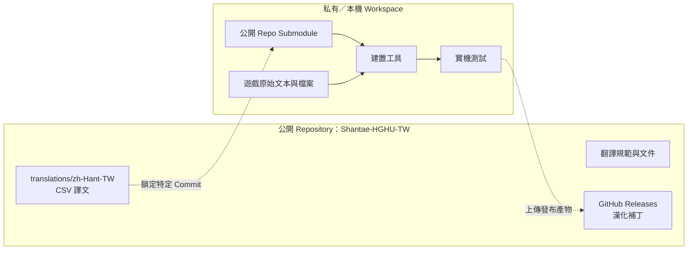
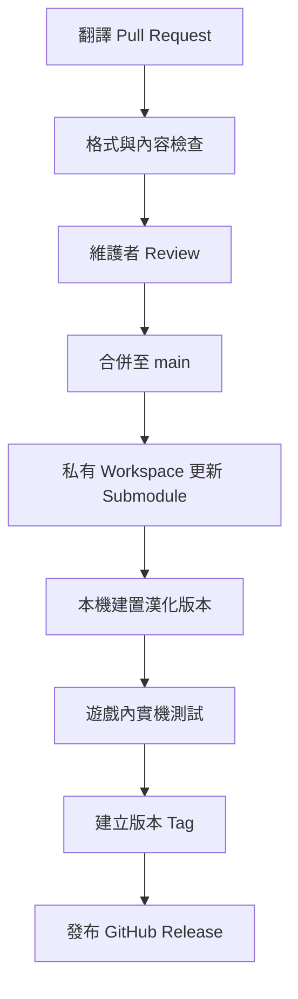

# Shantae-HGHU-TW

《桑塔：半精靈英雄 終極版》台灣正體中文漢化專案。

> Shantae: Half-Genie Hero Ultimate Edition — Traditional Chinese (Taiwan) localization project

## 專案定位

本 Repository 是公開的翻譯協作與版本發布入口，用於：

- 維護 `zh-Hant-TW` 台灣正體中文譯文。
- 接受翻譯修正 Pull Request。
- 記錄翻譯規範、詞彙與已知問題。
- 透過 GitHub Releases 發布經測試的漢化版本。

完整建置環境、遊戲原始文本與正版遊戲檔案不會存放於本 Repository。

## Repository 關係



## 翻譯 PR 資料流



## 目錄規劃

```text
translations/zh-Hant-TW/   可透過 PR 修改的 CSV 譯文
docs/                       安裝、相容性與已知問題
.github/                    PR Template 與自動檢查
release/                    Release 格式與打包說明
```

實際翻譯 CSV 將從本機 Workspace 審核後匯入；本 Repository 不收錄官方完整原始文本、遊戲資源或反編譯程式碼。

## 貢獻

提交翻譯修正前，請閱讀：

- [CONTRIBUTING.md](CONTRIBUTING.md)
- [TRANSLATION_GUIDE.md](TRANSLATION_GUIDE.md)

## 授權與權利聲明

本專案為非官方社群漢化專案。程式碼授權請參閱 [LICENSE](LICENSE)，第三方商標、遊戲內容及翻譯相關聲明請參閱 [NOTICE.md](NOTICE.md)。
